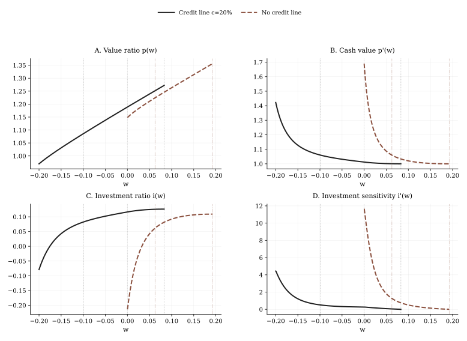

# BCW2011 Credit Line Walkthrough

Read this page after [BCW2011 Hedging Walkthrough](./bcw2011-hedging-walkthrough.md).

This page is the formula-first walkthrough for:

- `src/example/BCW2011CreditLine.py`

## Goal

By the end of this page, you should understand:

- why the state domain expands from `[0, \bar w]` to `[-c, \bar w]`,
- how BCW's cash region and credit region are combined in one FinHJB solve,
- how issuance and payout conditions coexist with a piecewise HJB,
- why Figure 7 is the repository's clearest example of regime-dependent residual logic.

## Run Contract

Run this example from the repository root:

```bash
MPLBACKEND=Agg uv run python src/example/BCW2011CreditLine.py
```

## What Changes Relative To Refinancing

The refinancing case assumes the firm issues equity when cash hits zero. The credit-line case inserts another financing layer in the pecking order:

1. internal cash,
2. credit line,
3. external equity.

This changes both the admissible state domain and the HJB.

## Paper Equations Used In This Case

### Cash Region

For `w > 0`, the firm is financing on internal cash, so the value function still satisfies BCW Eq. (13):

$$
r p(w) =
\left(i(w) - \delta\right)\left(p(w) - w p'(w)\right)
+ \left((r-\lambda)w + \mu - i(w) - g(i(w))\right)p'(w)
+ \frac{\sigma^2}{2} p''(w).
$$

### Credit Region: Eq. (31)

For `w < 0`, the marginal source of financing is the credit line, so the carrying term changes:

$$
r p(w) =
\left(i(w) - \delta\right)\left(p(w) - w p'(w)\right)
+ \left((r+\alpha)w + \mu - i(w) - g(i(w))\right)p'(w)
+ \frac{\sigma^2}{2} p''(w).
$$

The only structural difference is the financing term:

- `(r-\lambda)w` in the cash region,
- `(r+\alpha)w` in the credit region.

That simple switch creates the paper's different economics on the two sides of `w=0`.

### Issuance Condition With A Credit Line

Once the firm exhausts the line at `w=-c`, issuance satisfies:

$$
p(-c) = p(m) - \phi - (1+\gamma)(m+c),
$$

$$
p'(m) = 1 + \gamma.
$$

So the credit line changes the location of the issuance trigger and the total equity raise amount, but not the smooth-pasting logic after issuance.

### Continuity At `w=0`

BCW states that the value function is continuous and smooth at `w=0`.

The repository implementation handles this numerically by solving one common value function on the entire domain `[-c, \bar w]` with one shared grid and one shared derivative operator:

- the residual switches funding terms when `w` changes sign,
- but `v`, `dv`, and `d2v` are still solved as one object on one grid.

So the stitching at `w=0` is not implemented as an extra explicit boundary target. It is enforced numerically by solving a single global object across both regimes.

## How The Piecewise Problem Becomes FinHJB Code

| Economic object | FinHJB object | Repository role |
|---|---|---|
| credit-line parameters | `Parameter` | adds `c` and `alpha` to the refinancing baseline |
| extended state domain | `Boundary.compute_s_min(...)` | sets `s_min = -c` |
| investment control | `PolicyDict` | still only needs `investment` |
| investment FOC | `Policy` | unchanged Eq. (14) rule |
| piecewise HJB | `credit_line_hjb_residual(...)` + `Model.hjb_residual(...)` | switches financing term by region |
| issuance boundary | `refinancing_boundary_residual(..., extra_raise=c)` | adjusts Eq. (19) for issuance at `w=-c` |

This is the key modeling pattern to notice:

- the state grid crosses a regime boundary,
- the value function stays global,
- the residual changes by region.

## Why The Solver Still Searches `v_left` And `s_max`

Even though the state domain is larger, the outer unknowns are familiar:

- the left boundary value at `w=-c`,
- the right payout boundary `\bar w`.

The issuance amount is again inferred from the derivative condition `p'(m)=1+\gamma`.

So the repository still uses a two-target `boundary_search(method="hybr")`, with the only modification being that the left issuance residual accounts for the extra draw `c`.

## Figure 7: How To Read The Comparison



### Panel A: `p(w)`

Access to the credit line raises value and moves the payout boundary left. The firm needs to hoard less precautionary cash.

### Panel B: `p'(w)`

The marginal value of cash near `w=0` collapses relative to the no-credit benchmark because hitting zero cash no longer means immediate issuance.

### Panel C: `i(w)`

Underinvestment is sharply mitigated. With a credit line, investment at `w=0` remains positive instead of turning into large asset sales.

### Panel D: `i'(w)`

The investment-cash sensitivity is flatter near the cash boundary because the financing regime changes more smoothly than in the no-credit benchmark.

## Stable Quantitative Targets

Healthy runs usually show:

- with `c=20%`: `\bar w \approx 0.08`,
- with `c=20%`: `c+m \approx 0.10`,
- with `c=20%`: `p'(0) \approx 1.01`,
- without a credit line: `\bar w \approx 0.19`, `p'(0) \approx 1.69`,
- with a credit line: `i(0) > 0`,
- without a credit line: `i(0) < 0`.

These are the right checks against BCW Figure 7.

## Code Inspection Pattern

```python
from src.example.BCW2011CreditLine import run_case

bundle = run_case(number=1000)
for label, result in bundle["results"].items():
    print(label, result["summary"])
```

The summary fields to inspect first are:

- `credit_limit`,
- `equity_raise_amount`,
- `dv_at_zero`,
- `investment_at_zero`,
- `state_min`.

## How To Adapt This Pattern

Start from this case if your own model has:

- a single state variable but multiple financing regimes,
- a negative-state debt region,
- a piecewise HJB residual on a shared grid,
- issuance after another financing source is exhausted.

This is the cleanest repository template for regime-dependent one-dimensional finance models.

## Next Step

- Revisit [Results and Diagnostics](./results-and-diagnostics.md) to inspect the negative-`w` region directly on the solved grid.
- Then move to [Adapting BCW To Your Model](./adapting-bcw-to-your-model.md) if you want to reuse the regime-switching pattern in your own model.
