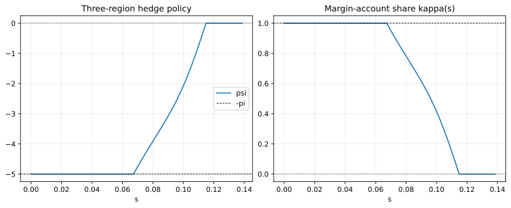

# BCW2011 Hedging Walkthrough

This page is the second BCW tutorial page:

- `src/example/BCW2011Hedging.py`

It should be read after the liquidation walkthrough, because the hedging example reuses the same basic HJB structure and then adds a second control plus refinancing-aware boundary logic.

## Goal

By the end of this page, you should understand:

- how the hedging extension changes the liquidation baseline,
- what `psi` and `kappa` mean economically,
- why the hedge policy has a three-region structure,
- how to tell whether the hedging solve is numerically healthy.

## Prerequisites

Before using this page, you should already be comfortable with:

- [Getting Started](./getting-started.md),
- [BCW2011 Liquidation Walkthrough](./bcw2011-liquidation-walkthrough.md),
- basic interpretation of `v`, `dv`, and `d2v`.

## Run Command

```bash
MPLBACKEND=Agg uv run python src/example/BCW2011Hedging.py
```

## What Changes Relative To Liquidation

The hedging case keeps the same one-dimensional state variable but introduces additional economics:

- external financing costs through `phi` and `gamma`,
- hedge demand through `psi`,
- a margin-account mechanism summarized by `kappa`,
- an updated left boundary tied to refinancing.

So the educational jump from liquidation to hedging is not "new package features only." It is also "new economic objects require different numerical workflows."

## What The Main Script Actually Runs

The current example script's main workflow is still:

```python
state = solver.boundary_search(method="bisection", verbose=False)
```

For this hedging implementation, `boundary_condition()` returns two active targets:

- `s_max`,
- `v_left`.

That means the example is solving a two-boundary search problem directly through `boundary_search()`. The `update_boundary(grid)` method is still useful, but here it is best read as an extra reusable pattern for future models rather than the default workflow of the example script.

## Extra Parameters To Understand

| Parameter | Meaning |
|---|---|
| `phi` | fixed external financing cost |
| `gamma` | proportional external financing cost |
| `rho` | correlation between productivity shock and market return |
| `sigma_m` | volatility of the futures/index hedge |
| `pi` | hedge limit or margin multiplier |
| `epsilon` | flow cost of cash held in the margin account |

These are the parameters that most visibly change the policy logic compared with the liquidation case.

## Equation-To-Code Map

| Economic object | Script location | Interpretation |
|---|---|---|
| frictionless hedge benchmark | `Policy.initialize` | starting guess for `psi` |
| interior hedge FOC | `Policy.cal_policy` | unconstrained hedge demand |
| maximum hedge region | `psi_clipped = max(psi_interior, -pi)` | low-cash binding region |
| zero-hedge region | `jnp.where(should_hedge, psi_clipped, 0.0)` | high-cash no-hedge region |
| margin share `kappa` | `kappa = min(|psi| / pi, 1)` | fraction of cash effectively tied up in margin account |
| refinancing search target | `boundary_condition()` | solve `v_left` from the issuance condition during boundary search |
| optional update helper | `update_boundary(grid)` | reusable boundary-update-compatible version of the same refinancing logic |

## The Three Hedge Regions

The repository comments already point to the BCW three-region interpretation:

1. low cash: hedge is fully binding and `psi = -pi`,
2. interior region: hedge follows the interior FOC,
3. high cash: hedging goes to zero.

That shape is more important than matching one exact number at one grid point.

## Why `psi` Runs From `-pi` To `0`

In this implementation:

- more negative `psi` means more hedge demand,
- `-pi` is the binding lower limit,
- `0` is the no-hedge region.

So a healthy BCW hedging solve often looks like this:

- `psi` is flat at `-5.0` in the distressed region,
- then it rises,
- then it reaches `0.0` and stays there.

## Why `kappa` Matters

`kappa` summarizes how much of the firm's cash is effectively committed to the margin account:

```python
kappa = jnp.minimum(jnp.abs(psi) / p.pi, 1.0)
```

Economic reading:

- when hedge demand is large in magnitude, more cash is tied up in margin,
- margin usage feeds back into the cash-flow term,
- this changes the HJB residual and therefore changes both value and investment policies.

This is why the hedging case is not just "liquidation plus one extra plotted line." The second control changes the economics of the state dynamics.

## Representative Output

One representative solve in this repository produced:

```text
HEDGE_BOUNDARY ImmutableBoundary(s_min=0.0, s_max=0.13850403, v_left=1.16119385, v_right=1.31352204)
```

Head of the solved DataFrame:

```text
       s        v       dv        d2v  investment  psi
0.000000 1.161194 1.818353 -54.285395   -0.240936 -5.0
0.000139 1.161445 1.810904 -53.726194   -0.239184 -5.0
0.000277 1.161696 1.803494 -53.166992   -0.237427 -5.0
0.000416 1.161946 1.796161 -52.613947   -0.235674 -5.0
0.000555 1.162194 1.788905 -52.066995   -0.233924 -5.0
```

Tail of the solved DataFrame:

```text
       s        v  dv           d2v  investment  psi
0.137949 1.312967 1.0 -1.376132e-03    0.116678  0.0
0.138088 1.313106 1.0 -1.031406e-03    0.116678  0.0
0.138227 1.313245 1.0 -6.873962e-04    0.116679  0.0
0.138365 1.313383 1.0 -3.440447e-04    0.116679  0.0
0.138504 1.313522 1.0 -7.046545e-07    0.116679  0.0
```

What this output tells you:

- the left value is above pure liquidation because refinancing is active,
- the hedge is fully binding at the left edge,
- the right tail again satisfies the contact condition through `d2v[-1]`,
- investment remains negative in distressed states and recovers near the right boundary.

## BCW Benchmark Magnitudes To Cross-Check

For this implementation, the most useful BCW-style benchmark magnitudes are:

- maximum-hedging boundary `w_- ≈ 0.067`,
- zero-hedging boundary `w_+ ≈ 0.115`,
- payout boundary `w_bar ≈ 0.1385`,
- hedge ratio range `psi ∈ [-5, 0]`.

Those values match both the current repository output and the qualitative benchmark pattern discussed in BCW.

## Visual Checks

### Overall policy and value shape


Look for:

- increasing value with cash,
- recovering investment policy,
- a hedge policy that relaxes as cash rises.

### Hedge-region picture



Look for:

- a binding left region at `psi = -5`,
- a transition region,
- a right region at `psi = 0`.

## Success Checklist

| Checkpoint | Healthy pattern |
|---|---|
| `grid.boundary.v_left` | clearly above `0.9` |
| `grid.boundary.s_max` | roughly `0.14` |
| `grid.d2v[-1]` | very close to `0` |
| `psi.min()` | near `-5.0` |
| `psi.max()` | near `0.0` |
| left tail hedge | pinned at lower bound |
| right tail hedge | relaxed to zero |

## Refinancing Boundary Logic

The hedging script also implements:

```python
def update_boundary(grid):
    ...
```

This does not mean the example script itself defaults to `boundary_update()`. The current script still uses `boundary_search(method="bisection")` as the main workflow.

What `update_boundary(grid)` gives you is a second, reusable expression of the same refinancing logic:

- solve on the current boundary,
- read a refinancing-implied quantity from the solved grid,
- update the left value boundary,
- solve again.

That is why the hedging case is a good bridge from "I can reproduce BCW" to "I can design my own workflow." It shows both the current script's direct boundary-search path and an alternative boundary-update-compatible hook.

## Common Failure Symptoms

### `psi` never leaves `-pi`

Possible causes:

- the interior hedge formula is unstable,
- the no-hedge test is never triggered,
- the model is effectively stuck in the distressed region.

### `psi` becomes positive

That is a warning sign for this specific example. Re-check:

- the sign conventions in the hedge FOC,
- the clipping logic,
- the `should_hedge` condition.

### `v_left` stays near liquidation value

Likely causes:

- the refinancing boundary update is not being used,
- or the financing-cost logic is not being transmitted into the boundary condition properly.

## A Useful Interactive Inspection Snippet

```python
import finhjb as fjb
from src.example.BCW2011Hedging import Boundary, Model, Parameter, Policy

parameter = Parameter()
boundary = Boundary(p=parameter, s_min=0.0, s_max=0.13)
solver = fjb.Solver(boundary=boundary, model=Model(policy=Policy()), number=1000)
state = solver.boundary_search(method="bisection", verbose=False)
grid = state.grid

print(grid.boundary)
print(grid.df[["s", "investment", "psi"]].head())
print(grid.df[["s", "investment", "psi"]].tail())
```

## Next Step

Go to [Results and Diagnostics](./results-and-diagnostics.md) if you want a structured guide to reading states, histories, grids, and continuation results.

If your goal is to change the economics rather than just understand BCW, continue to [Adapting BCW to Your Model](./adapting-bcw-to-your-model.md).
