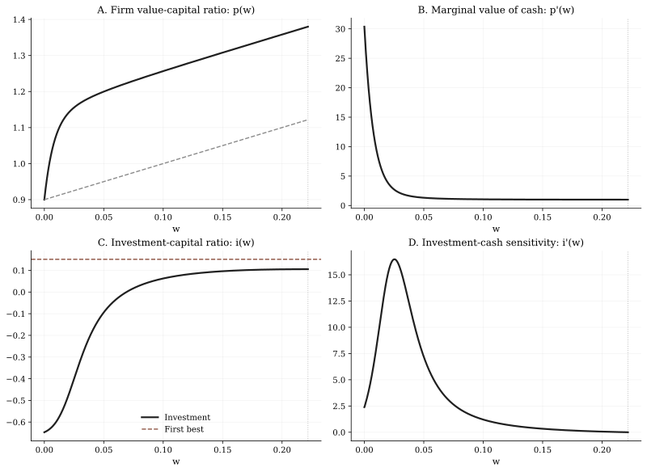

# BCW2011 Liquidation Walkthrough

Read this page after [Getting Started](./getting-started.md) and [BCW2011 Case Study](./bcw2011-case-study.md).

This page is the formula-first walkthrough for:

- `src/example/BCW2011Liquidation.py`

## Goal

By the end of this page, you should be able to move in both directions:

- from BCW's liquidation equations to the FinHJB implementation,
- from the FinHJB classes back to the economics they represent.

This is the cleanest entry point because the case has:

- one state variable,
- one control,
- one endogenous boundary target,
- no refinancing and no regime switching.

## Run Contract

Run this example from the repository root:

```bash
MPLBACKEND=Agg uv run python src/example/BCW2011Liquidation.py
```

The BCW scripts are documented and supported as repository-root examples. They are not designed around local-directory execution inside `src/example/`.

## Economic Setup And State Reduction

The original BCW problem is written in firm capital `K` and cash `W`. FinHJB solves the one-dimensional reduced form after BCW's homogeneity step:

$$
P(K, W) = K p(w), \qquad w = W/K.
$$

This reduction is what makes the example fit the current one-dimensional FinHJB interface.

The paper's key objects become:

$$
P_K = p(w) - w p'(w), \qquad P_W = p'(w), \qquad P_{WW} = p''(w) / K.
$$

In repository terms:

- `grid.s` stores the state grid for `w`,
- `grid.v` stores the solved value-capital ratio `p(w)`,
- `grid.dv` stores the marginal value of cash `p'(w)`,
- `grid.d2v` stores the curvature `p''(w)`.

## Paper Equations Used In This Case

The liquidation case uses BCW's internal-financing HJB and the liquidation/payout boundaries.

### HJB: Eq. (13)

$$
r p(w) =
\left(i(w) - \delta\right)\left(p(w) - w p'(w)\right)
+ \left((r-\lambda)w + \mu - i(w) - g(i(w))\right)p'(w)
+ \frac{\sigma^2}{2} p''(w).
$$

With BCW's quadratic adjustment cost,

$$
g(i) = \frac{\theta i^2}{2}.
$$

### Investment FOC: Eq. (14)

$$
i(w) = \frac{1}{\theta}\left(\frac{p(w)}{p'(w)} - w - 1\right).
$$

### Boundary Conditions: Eq. (16)-(18)

At the payout boundary `\bar w`:

$$
p'(\bar w) = 1, \qquad p''(\bar w) = 0.
$$

At the liquidation boundary:

$$
p(0) = l.
$$

## How Those Equations Become FinHJB Objects

The repository implementation follows a stable object mapping:

| Economic object | FinHJB object | What it does in this case |
|---|---|---|
| benchmark parameters | `Parameter` | stores Table I values such as `r`, `delta`, `mu`, `sigma`, `theta`, `lambda_`, `l` |
| left and right boundary values | `Boundary` | pins `p(0)=l` and provides the payout-side closed-form value |
| control container | `PolicyDict` | stores the single control `investment` |
| investment update | `Policy` | imposes Eq. (14) as an implicit policy residual |
| HJB residual | `Model` | imposes Eq. (13) on the interior grid |

In code, the exact decomposition is:

- Eq. (14) is implemented through `investment_rule_residual(...)` and exposed in `Policy.cal_investment(...)`.
- Eq. (13) is implemented through `standard_hjb_residual(...)` and called from `Model.hjb_residual(...)`.
- `Boundary.compute_v_left(...)` returns the liquidation value `l`.
- `Boundary.compute_v_right(...)` uses the payout-side closed form implied by Eq. (16).

This is the clean pattern FinHJB expects for a one-control continuous-time model:

1. put primitive parameters in `Parameter`,
2. put boundary values in `Boundary`,
3. put controls in `PolicyDict`,
4. encode the FOC in `Policy`,
5. encode the HJB in `Model`.

## Why The Numerical Workflow Is `boundary_search(method="bisection")`

The liquidation case has one endogenous object to solve for numerically:

- the payout boundary `\bar w`.

The left boundary is fixed at `w = 0` with `p(0)=l`. The right boundary is pinned by the super-contact condition:

$$
p''(\bar w) = 0.
$$

Numerically, that becomes:

- search over `s_max = \bar w`,
- evaluate `grid.d2v[-1]`,
- stop when the right-tail curvature is approximately zero.

That is exactly why the script uses a one-target `boundary_search()` with `bisection`:

- there is only one unknown boundary target,
- the search bracket is economically well-behaved,
- the root condition is scalar and monotone enough for bisection to be robust.

## Boundary Logic In Repository Terms

This case uses three layers of boundary information:

1. Left boundary:
   `Boundary.compute_v_left(...) = l`

2. Right boundary value:
   the script uses the payout-side closed-form value consistent with BCW's payout region and `p'(\bar w)=1`

3. Right boundary optimality target:
   `super_contact_residual(grid) = grid.d2v[-1]`

This separation matters. In FinHJB, the boundary value and the boundary optimality condition are not the same object:

- the boundary value tells the solver what value to pin at the grid edge,
- the boundary target tells the outer search how to move the edge itself.

## Figure 2: How To Read The Output Economically



### Panel A: `p(w)`

The value-capital ratio starts at liquidation value `l=0.9`, stays above the liquidation line `l+w`, and bends into the payout boundary near `\bar w \approx 0.22`.

That is BCW's statement that the firm does not liquidate early even when refinancing is unavailable.

### Panel B: `p'(w)`

The marginal value of cash explodes as `w \to 0`. In this case, extra cash is valuable because it delays forced liquidation.

### Panel C: `i(w)`

Investment becomes negative near zero cash. In BCW's language, the firm sells assets to move away from the liquidation boundary.

### Panel D: `i'(w)`

Investment rises with cash, but not linearly. This is the right object to inspect when you want to discuss investment-cash sensitivity rather than just the investment level.

## Stable Quantitative Targets

Healthy runs in this repository usually look like:

- `\bar w \approx 0.22`,
- `p'(0) \approx 30`,
- `i(\bar w) \approx 10.5%`,
- strongly negative investment close to `w=0`,
- `p''(\bar w)` numerically close to zero.

Those are the right first checks before you read deeper meaning into minor grid-level differences.

## Code Inspection Pattern

```python
from src.example.BCW2011Liquidation import run_case

bundle = run_case(number=1000)
result = bundle["results"]["baseline"]

print(result["summary"])
print(result["grid"].df.head())
print(result["grid"].df.tail())
```

The key quantities to inspect are:

- `result["summary"]["payout_boundary"]`,
- `result["summary"]["dv_at_zero"]`,
- `result["grid"].d2v[-1]`,
- `result["grid"].policy["investment"]`.

## How To Adapt This Pattern

Start from this case if your own model still has:

- one reduced state variable,
- one control,
- a fixed left boundary,
- a single endogenous payout boundary on the right.

Only move to the later BCW examples if your model genuinely needs:

- issuance with value matching,
- multiple controls,
- or a piecewise residual across regions.

## Next Step

- Continue to [BCW2011 Refinancing Walkthrough](./bcw2011-refinancing-walkthrough.md).
- Use [Results and Diagnostics](./results-and-diagnostics.md) once you want a solver-centric view of `grid`, `summary`, and boundary diagnostics.
