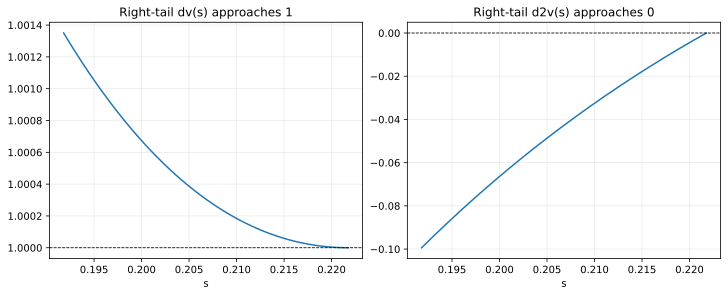

# BCW2011 Liquidation Walkthrough

This page is the first deep-dive page in the BCW path.

Read it after [Getting Started](./getting-started.md) and [BCW2011 Case Study](./bcw2011-case-study.md).

Read [Library Quickstart](./quickstart-library.md) instead if you want the shortest direct package workflow.

This page is the detailed walkthrough for the first BCW example:

- `src/example/BCW2011Liquidation.py`

It explains not only how to run the example, but how to read the code and decide whether the result is healthy.

## Goal

By the end of this page, you should understand:

- what the liquidation example is solving,
- how the BCW equations map into `Parameter`, `Boundary`, `Policy`, and `Model`,
- why the solver searches over `s_max`,
- how to verify the resulting value and policy functions.

## Prerequisites

You should already be able to do all of these:

- import `finhjb`,
- run commands from the repository root,
- use `MPLBACKEND=Agg` if you are on a headless machine.

If not, start with [Installation and Environment](./installation-and-environment.md).

## Run Command

```bash
MPLBACKEND=Agg uv run python src/example/BCW2011Liquidation.py
```

This script:

1. defines BCW Table I baseline parameters,
2. constructs a liquidation boundary problem,
3. runs a right-boundary search using `bisection`,
4. prints the final state and inspects the solved grid.

## What The Example Is Solving

The state variable is cash scaled by capital.

The code uses:

- `s` for the state grid,
- `v` for the value-capital ratio,
- `dv` for the marginal value of cash,
- `d2v` for curvature,
- `investment` for the optimal investment-capital ratio.

Economically, the liquidation case teaches the most important "baseline friction" intuition:

- when cash is scarce, investment is sharply constrained,
- as cash rises, investment recovers,
- the payout-side boundary is not fixed ex ante and must be solved so the right-tail contact condition holds.

## Equation-To-Code Map

The example script already annotates the main landmarks. The most important ones are:

| BCW object | Script location | What it means in practice |
|---|---|---|
| Eq. (7) first-best investment rule | `Policy.initialize` | creates a stable starting guess |
| Eq. (14) investment rule | `Policy.cal_investment_without_explicit` | solved as an implicit residual |
| Eq. (13) HJB equation | `Model.hjb_residual` | the interior equation the solver drives toward zero |
| Eq. (18) liquidation value | `Boundary.compute_v_left` | pins `v_left = l` |
| Eq. (17) super-contact condition | `Model.boundary_condition` | implemented numerically as `grid.d2v[-1]` |

The critical learning idea is that the numerical target for the right boundary is not "match one printed number." It is "choose `s_max` so the right-tail contact condition is satisfied."

## Code Structure, Step By Step

## 1. Parameters

The `Parameter` class stores the economic constants:

- `r`, `delta`, `mu`, `sigma`,
- `theta` for adjustment costs,
- `lambda_` for carrying costs,
- `l` for liquidation value.

If you later adapt BCW to your own model, this class is usually the first place you edit.

## 2. Boundary

The `Boundary` class does two things:

- it fixes the left value boundary through `compute_v_left`,
- it computes `v_right` from `s_max`.

This matters because `v_right` is not treated as an unrelated constant. It is derived from the candidate right state boundary.

## 3. Policy

The liquidation case uses one control:

- `investment`.

The initializer uses the first-best investment rule as a numerically reasonable guess. The update itself is implemented with `@implicit_policy(...)`, which is useful because the natural mathematical object is a residual equation rather than a direct closed form in the code path.

## 4. Model

`Model.hjb_residual` combines:

- the capital drift term,
- discounting,
- cash drift,
- diffusion.

If you are ever unsure whether your custom model is wrong, comparing its residual structure against this compact BCW baseline is one of the best debugging moves.

## 5. Boundary Search

The search target is:

```python
def s_max_condition(grid) -> float:
    return grid.d2v[-1]
```

Interpretation:

- the solver proposes a candidate `s_max`,
- solves the HJB on that candidate boundary,
- evaluates the resulting right-tail curvature,
- keeps searching until the curvature is approximately zero.

That is why `d2v[-1]` is the single most important scalar diagnostic in this example.

## Representative Output

One representative solve in this repository produced:

```text
LIQ_BOUNDARY ImmutableBoundary(s_min=0.0, s_max=0.22176666, v_left=0.9, v_right=1.380003)
```

Head of the solved DataFrame:

```text
       s        v        dv          d2v  investment
0.000000 0.900000 30.369404 -3666.264845   -0.646910
0.000222 0.906654 29.577508 -3567.279695   -0.646379
0.000444 0.913132 28.796599 -3468.294545   -0.645823
0.000666 0.919439 28.037362 -3372.026647   -0.645248
0.000888 0.925580 27.299203 -3278.402476   -0.644655
```

Tail of the solved DataFrame:

```text
       s        v       dv           d2v  investment
0.220879 1.379115 1.000001 -2.212603e-03    0.105490
0.221101 1.379337 1.000001 -1.656398e-03    0.105490
0.221323 1.379559 1.000000 -1.102528e-03    0.105491
0.221545 1.379781 1.000000 -5.509463e-04    0.105491
0.221767 1.380003 1.000000  6.263160e-07    0.105491
```

These numbers are not meant to be memorized. They are useful because they show the correct shape:

- very high marginal value of cash at the left edge,
- strong negative curvature in distressed states,
- `dv` approaching `1`,
- `d2v` approaching `0`,
- investment rising from negative to slightly positive.

## BCW Benchmark Magnitudes To Cross-Check

These repository outputs also line up with the benchmark magnitudes discussed in BCW:

- payout boundary `w_bar` is about `0.2218`,
- marginal value of cash near zero satisfies `p'(0) ≈ 30`,
- low-cash investment is about `-0.647`, meaning asset sales exceed 60% at an annual rate,
- right-boundary investment is about `0.105`.

So if your run lands in that neighborhood, you are matching not only this repository's example output but also the scale emphasized in the paper.

## Visual Checks

### Overall shape


What to look for:

- `v` should be increasing in `s`,
- `dv` should be high on the left and move toward `1`,
- investment should rise with cash.

### Right-tail curvature



What to look for:

- `d2v` should approach zero smoothly at the right edge,
- the final few grid points should not oscillate wildly,
- the curve should not blow up as it approaches the boundary.

## Success Checklist

Treat these as stable ranges and patterns, not brittle exact values.

| Checkpoint | Healthy pattern |
|---|---|
| `grid.dv[0]` | roughly `30` |
| `grid.v[0]` | exactly or almost exactly `0.9` |
| `grid.boundary.s_max` | roughly `0.22` |
| `grid.dv[-1]` | essentially `1.0` |
| `grid.d2v[-1]` | very close to `0` |
| `investment.min()` | clearly negative |
| `investment.max()` | mildly positive near the right boundary |

## Why Negative Investment At Low Cash Is Not A Bug

New users often expect investment to stay positive everywhere.

In this example, low-cash states are exactly where financing frictions are most severe. So a strongly negative low-cash investment policy is economically consistent with the BCW setup. The important question is not "is it negative?" but:

- does it rise as cash improves?
- does it connect smoothly to the healthier right tail?

## A Useful Interactive Inspection Snippet

After solving, inspect the object directly:

```python
import finhjb as fjb
from src.example.BCW2011Liquidation import Boundary, Model, Parameter, Policy

parameter = Parameter()
boundary = Boundary(p=parameter, s_min=0.0, s_max=0.2)
solver = fjb.Solver(boundary=boundary, model=Model(policy=Policy()), number=1000)
state = solver.boundary_search(method="bisection", verbose=False)
grid = state.grid

print(grid.boundary)
print(grid.df[["s", "v", "dv", "d2v", "investment"]].tail())
```

If you can read that output comfortably, you are ready for the next BCW page.

## Common Failure Symptoms

### `d2v[-1]` is far from zero

Most likely causes:

- the boundary search target is not the intended one,
- the base solve is unstable,
- the bracket is poor.

### `dv[-1]` is not close to one

Likely causes:

- right boundary interpretation is wrong,
- the solve never really reached the payout-side regime,
- the grid is too coarse or the equations are inconsistent.

### The whole curve looks noisy

Check:

- whether the environment is stable,
- whether the policy formula is coded correctly,
- whether you are comparing against the correct case.

## Next Step

- Read [Results and Diagnostics](./results-and-diagnostics.md) to inspect `state`, `history`, and `grid` systematically.
- Continue to [BCW2011 Hedging Walkthrough](./bcw2011-hedging-walkthrough.md) for the second BCW case.
- Read [Adapting BCW to Your Model](./adapting-bcw-to-your-model.md) if you already want to start customizing from the liquidation template.
