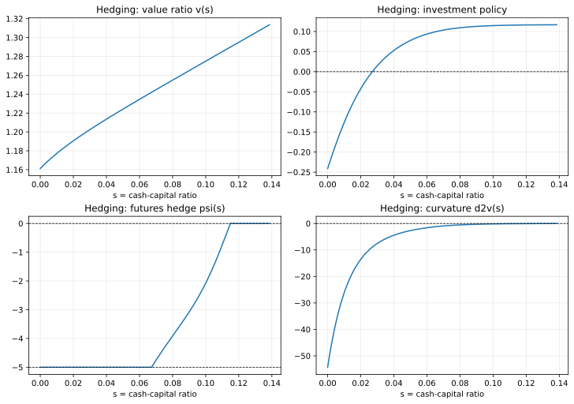

# BCW2011 Hedging 逐步讲解

这一页对应第二个 BCW 教程案例：

- `src/example/BCW2011Hedging.py`

建议在 liquidation walkthrough 之后阅读，因为 hedging 案例是在同一条 HJB 主线上，进一步加入第二个控制变量和再融资边界逻辑。

## 目标

读完这一页后，你应该理解：

- hedging 扩展相对 liquidation 到底多了什么；
- `psi` 和 `kappa` 的经济含义是什么；
- 为什么对冲策略会呈现“三分区”结构；
- 如何判断 hedging 求解结果是否数值健康。

## 前置条件

建议你先熟悉：

- [快速开始](./getting-started.md)
- [BCW Liquidation 逐步讲解](./bcw2011-liquidation-walkthrough.md)
- `v`、`dv`、`d2v` 的基本含义

## 运行命令

```bash
MPLBACKEND=Agg uv run python src/example/BCW2011Hedging.py
```

## 相比 liquidation，多了什么

hedging 案例保留了一维状态变量，但加入了新的经济结构：

- 外部融资成本 `phi` 和 `gamma`；
- 对冲控制变量 `psi`；
- 保证金账户机制 `kappa`；
- 与再融资相关的左边界更新逻辑。

因此，从 liquidation 过渡到 hedging，不只是“代码里多画了一条线”，而是：

- 控制变量变多了，
- 状态动态和残差结构变了，
- 边界工作流也更复杂了。

## 需要先理解的新参数

| 参数 | 经济含义 |
|---|---|
| `phi` | 固定外部融资成本 |
| `gamma` | 比例型外部融资成本 |
| `rho` | 生产率冲击与市场收益的相关性 |
| `sigma_m` | 对冲标的（期货/指数）的波动率 |
| `pi` | 对冲约束或保证金倍数 |
| `epsilon` | 保证金账户资金占用带来的流量成本 |

## 方程到代码的映射

| 经济对象 | 脚本位置 | 如何理解 |
|---|---|---|
| frictionless hedge benchmark | `Policy.initialize` | `psi` 的起始猜测 |
| interior hedge FOC | `Policy.cal_policy` | 内部区间的对冲需求 |
| 最大对冲区 | `psi_clipped = max(psi_interior, -pi)` | 低现金状态下的绑定区 |
| 零对冲区 | `jnp.where(should_hedge, psi_clipped, 0.0)` | 高现金状态下的无对冲区 |
| 保证金占比 `kappa` | `kappa = min(|psi| / pi, 1)` | 有多少现金被占用于保证金账户 |
| 再融资边界更新 | `update_boundary(grid)` | 根据解出的网格更新左边界 |

## 三分区对冲结构

仓库注释里已经指出了 BCW 的三分区：

1. 低现金区域：对冲完全绑定，`psi = -pi`；
2. 中间区域：进入内部解；
3. 高现金区域：最优对冲回到 `0`。

你真正要验证的是这个结构是否出现，而不是只盯住某一个网格点的数值。

## 为什么 `psi` 会在 `-pi` 到 `0` 之间变化

在这份实现里：

- `psi` 越负，代表对冲需求越强；
- `-pi` 是下界，也就是完全绑定的最大对冲状态；
- `0` 表示不对冲。

所以一个健康的 BCW hedging 解，通常长这样：

- 左端 `psi` 平贴在 `-5.0`；
- 中间逐步抬升；
- 右端最终贴到 `0.0`。

## 为什么 `kappa` 很重要

`kappa` 总结了有多少现金被保证金账户占用：

```python
kappa = jnp.minimum(jnp.abs(psi) / p.pi, 1.0)
```

经济解释是：

- 对冲需求越强，保证金占用越高；
- 保证金占用会反过来影响现金流漂移；
- 现金流漂移变了，HJB 残差、价值函数和投资策略都会跟着变。

这就是为什么 hedging 案例不是“liquidation + 一个额外控制”这么简单。

## 代表性输出

本仓库一次代表性求解结果为：

```text
HEDGE_BOUNDARY ImmutableBoundary(s_min=0.0, s_max=0.13850403, v_left=1.16119385, v_right=1.31352204)
```

DataFrame 头部大致是：

```text
       s        v       dv        d2v  investment  psi
0.000000 1.161194 1.818353 -54.285395   -0.240936 -5.0
0.000139 1.161445 1.810904 -53.726194   -0.239184 -5.0
0.000277 1.161696 1.803494 -53.166992   -0.237427 -5.0
0.000416 1.161946 1.796161 -52.613947   -0.235674 -5.0
0.000555 1.162194 1.788905 -52.066995   -0.233924 -5.0
```

尾部大致是：

```text
       s        v  dv           d2v  investment  psi
0.137949 1.312967 1.0 -1.376132e-03    0.116678  0.0
0.138088 1.313106 1.0 -1.031406e-03    0.116678  0.0
0.138227 1.313245 1.0 -6.873962e-04    0.116679  0.0
0.138365 1.313383 1.0 -3.440447e-04    0.116679  0.0
0.138504 1.313522 1.0 -7.046545e-07    0.116679  0.0
```

这些输出最重要的含义是：

- 左边界价值高于纯 liquidation，因为再融资机制在发挥作用；
- 左端对冲完全绑定；
- 右端仍通过 `d2v[-1]` 满足接触条件；
- 投资在困境状态下仍为负，在右端逐渐恢复。

## 图形检查

### 整体价值与策略形状



重点看：

- `v` 是否随现金上升；
- `investment` 是否逐步恢复；
- `psi` 是否随现金增加而减弱。

### 对冲三分区


重点看：

- 左边是否有一个 `psi = -5` 的绑定区；
- 中间是否存在过渡区；
- 右边是否回到 `psi = 0`。

## 成功检查表

| 检查点 | 健康运行的模式 |
|---|---|
| `grid.boundary.v_left` | 明显高于 `0.9` |
| `grid.boundary.s_max` | 大约 `0.14` |
| `grid.d2v[-1]` | 非常接近 `0` |
| `psi.min()` | 接近 `-5.0` |
| `psi.max()` | 接近 `0.0` |
| 左端对冲 | 贴着下界 |
| 右端对冲 | 回到零 |

## 再融资边界逻辑

hedging 脚本还实现了：

```python
def update_boundary(grid):
    ...
```

这很重要，因为 hedging 案例并不只是一个 boundary search 示例，它也展示了 `boundary_update()` 所需的典型逻辑：

1. 在当前边界下求解；
2. 从已解出的网格里读出新的边界信息；
3. 更新左边界值；
4. 继续求解。

这也是为什么 hedging 是从“会复现 BCW”走向“能搭自己的工作流”的桥梁案例。

## 常见失败症状

### `psi` 一直停在 `-pi`

可能原因：

- 内部区间对冲公式不稳定；
- 零对冲判定从未被触发；
- 整个解都被困在低现金区域。

### `psi` 变成正值

对这个具体案例而言，这是一个警报信号。请回查：

- 对冲 FOC 的符号；
- clipping 逻辑；
- `should_hedge` 判定条件。

### `v_left` 一直接近 liquidation 值

可能原因：

- 再融资边界更新没有真正生效；
- 融资成本逻辑没有正确传递到边界条件中。

## 一个很实用的交互式检查片段

```python
import finhjb as fjb
from src.example.BCW2011Hedging import Boundary, Model, Parameter, Policy

parameter = Parameter()
boundary = Boundary(p=parameter, s_min=0.0, s_max=0.13)
solver = fjb.Solver(boundary=boundary, model=Model(policy=Policy()), number=1000)
state = solver.boundary_search(method="bisection", verbose=False)
grid = state.grid

print(grid.boundary)
print(grid.df[["s", "investment", "psi"]].head())
print(grid.df[["s", "investment", "psi"]].tail())
```

## 下一步

如果你想系统学习怎么读 `state`、`history`、`grid` 与 continuation 结果，请看 [结果与诊断](./results-and-diagnostics.md)。

如果你的目标已经从“理解 BCW”转向“改成自己的模型”，下一页请看 [把 BCW 改成你自己的模型](./adapting-bcw-to-your-model.md)。

