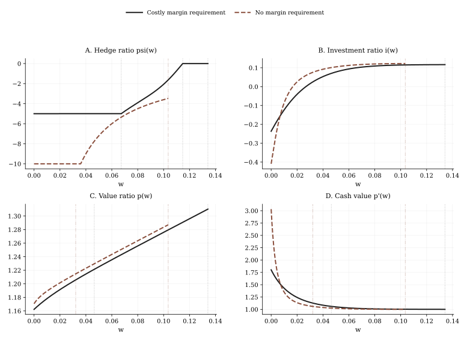

# BCW2011 Hedging 逐步讲解

建议在 [BCW2011 Refinancing 逐步讲解](./bcw2011-refinancing-walkthrough.md) 之后阅读。

这一页是下面这个仓库脚本的“公式到代码”讲解：

- `src/example/BCW2011Hedging.py`

## 目标

读完以后，你应该能理解：

- 为什么 BCW 的 hedging 案例不是“多画一条曲线”，而是 HJB 本身变了；
- Eq. (28)-(30) 如何变成一个双控制 FinHJB 问题；
- 为什么对冲策略会自然分成 maximum-hedging、interior、zero-hedging 三段；
- costly margin 解和 frictionless comparison object 在实现上到底有什么区别。

## 运行约定

请在仓库根目录执行：

```bash
MPLBACKEND=Agg uv run python src/example/BCW2011Hedging.py
```

## 相比 Refinancing，结构上变了什么

Hedging 案例保留了同一个降维状态变量 `w = W/K`，也保留了与 refinancing 相同的发行和 payout 逻辑。真正的结构变化是，公司现在同时选择：

- 投资 `i(w)`，
- 对冲头寸 `\psi(w)`。

所以它虽然还是一维状态问题，但已经是一个真正的多控制问题。

## 这个案例用到的论文方程

### 有保证金成本时的 HJB：Eq. (28)

BCW 的 HJB 变成：

$$
\begin{aligned}
rP(K,W) = \max_{I,\psi,\kappa} \;& (I-\delta K)P_K \\
&+ \left((r-\lambda)W + \mu K - I - G(I,K) - \epsilon \kappa W\right)P_W \\
&+ \frac{1}{2}\left(\sigma^2 K^2 + \psi^2 \sigma_m^2 W^2 + 2\rho\sigma_m\sigma\psi WK\right)P_{WW}.
\end{aligned}
$$

仓库实现里仍然是先做齐次性降维，再在 `w` 上求解。

### 保证金约束：Eq. (29)

$$
\kappa = \min\left\{\frac{|\psi|}{\pi}, 1\right\}.
$$

在 `\rho > 0` 的设定下，BCW 关注的是做空指数期货，因此 `\psi \leq 0`。

### 内部对冲规则：Eq. (30)

$$
\psi^*(w) =
\frac{1}{w}
\left(
\frac{-\rho \sigma}{\sigma_m}
- \frac{\epsilon}{\pi}\frac{p'(w)}{p''(w)}\frac{1}{\sigma_m^2}
\right).
$$

这是未受约束的内部对冲规则。真正的最优对冲需要再裁剪到可行区间：

- 在 maximum-hedging 区令 `\psi=-\pi`；
- 在 interior 区使用 Eq. (30)；
- 在 zero-hedging 区令 `\psi=0`。

### 无摩擦对照：Eq. (27)

论文里的 no-margin benchmark 会完全对冲系统性风险。仓库实现并没有在 FinHJB 外面单独放一个闭式 benchmark，而是通过下面这组参数解一个可比较的 HJB：

- `epsilon = 0`，
- `pi` 取非常大，
- 发行和 payout 流程与 costly-margin 情形保持一致，
- 画图接口也完全一致。

这样得到的是一个数值上可直接和 costly-margin 解并排比较的对象。

## 双控制问题如何变成 FinHJB 代码

| 经济对象 | FinHJB 对象 | 仓库里的角色 |
|---|---|---|
| 对冲相关参数 | `Parameter` | 在 refinancing baseline 上增加 `rho`、`sigma_m`、`pi`、`epsilon` |
| 控制变量 | `PolicyDict` | 保存 `investment`、`psi`、`psi_interior` |
| 策略更新 | `Policy.cal_policy(...)` | 一次性显式计算两个控制 |
| HJB 残差 | `Model.hjb_residual(...)` | 在降维后实现 Eq. (28) |
| 发行与 payout 边界 | `Boundary` + boundary targets | 沿用 refinancing 的外层逻辑 |

这里的关键设计是：

- `investment` 和 `psi` 在一次显式策略更新里一起算；
- `psi_interior` 会被单独存下来，这样即使真正的 `psi` 被裁剪了，代码仍然能诊断 `w_-` 和 `w_+`。

## 为什么外层还是 `boundary_search()`

虽然策略问题更复杂，但状态维度没有增加。外层数值问题仍然是在求：

- 左边发行 value，
- 右边 payout boundary。

所以整体流程还是：

1. 给定当前边界猜测解内部 HJB；
2. 从 `p'(w)` 恢复发行信息；
3. 更新边界 target；
4. 当 issuance matching 和 payout super-contact 同时满足时停止。

脚本固定使用 `method="hybr"`，因为双控制会更强地影响 value function 曲率，从而让两个边界 target 的耦合更明显。

## 三个对冲区域

仓库通过 `psi_interior` 恢复 BCW 里的两个 cutoff：

- `w_-` 满足 `\psi^*(w_-) = -\pi`，
- `w_+` 满足 `\psi^*(w_+) = 0`。

于是有三段经济解释：

1. `w \leq w_-`：maximum hedging，`psi=-pi`；
2. `w_- < w < w_+`：interior hedging，`psi=\psi^*(w)`；
3. `w \geq w_+`：不对冲，`psi=0`。

这是仓库里一个很重要的模式：把“内部控制规则”和“真正执行后的可行控制”同时存下来，既便于画图，也便于做经济诊断。

## Figure 6：如何读这个对照



### Panel A：`\psi(w)`

costly-margin 解呈现 BCW 论文里的三段结构。frictionless 对照线做了 display clipping，这和原文画图约定一致。

### Panel B：`i(w)`

对冲能力会改变投资，因为更好的风险管理会同时影响 firm value 和边际现金价值。

### Panel C：`p(w)`

风险管理改善会提高 value-capital ratio，但提升幅度在不同状态区间并不均匀。

### Panel D：`p'(w)`

在大多数区域里，更容易对冲会降低边际现金价值；但在极端受约束区域，额外现金本身还能扩张 hedging capacity，因此效果更复杂。

## 稳定的量级检查

健康运行通常表现为：

- costly margin：`w_- \approx 0.07`、`w_+ \approx 0.11`、`\bar w \approx 0.14`、`\psi \in [-5, 0]`；
- frictionless 对照：比 costly margin 更早进入 payout；
- 图上的 frictionless 线会在 `-10` 附近做 display clipping。

这些量是和 Figure 6 对照时最有信息量的检查点。

## 代码检查模式

```python
from src.example.BCW2011Hedging import run_case

bundle = run_case(number=1000)
for label, result in bundle["results"].items():
    print(label, result["summary"])
```

这个案例最值得先看的输出是：

- `psi`，
- `psi_interior`，
- `max_hedging_boundary`，
- `zero_hedging_boundary`，
- `return_cash_ratio`。

## 如何把这个模式迁移到自己的模型

如果你的模型具有下面这些结构，就优先从这个案例起步：

- 多于一个控制变量，
- 控制变量会进入扩散项，
- 存在“内部控制规则 + 可行域裁剪”的结构，
- 但边界逻辑整体仍更像 refinancing。

它最适合那些“复杂性来自策略，而不是来自多状态变量”的一维模型。

## 下一步

- 继续看 [BCW2011 Credit Line 逐步讲解](./bcw2011-credit-line-walkthrough.md)。
- 当你想从求解器角度看 `psi`、`psi_interior` 和切点诊断时，再配合 [结果与诊断](./results-and-diagnostics.md) 一起看。
