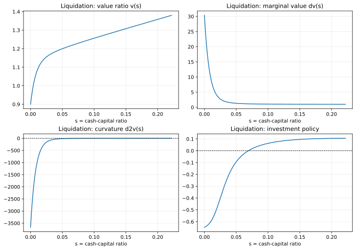

# BCW2011 Liquidation 逐步讲解

这一页详细拆解第一个 BCW 示例：

- `src/example/BCW2011Liquidation.py`

它应该在 [快速开始](./getting-started.md) 之后阅读。目标不只是告诉你“命令怎么敲”，而是帮助你把代码、论文方程和结果诊断真正连起来。

## 目标

读完这一页后，你应该理解：

- liquidation 案例到底在求什么；
- BCW 方程是如何映射到 `Parameter`、`Boundary`、`Policy`、`Model` 中的；
- 为什么求解器要搜索 `s_max`；
- 怎么判断解出来的价值函数和策略函数是健康的。

## 前置条件

你至少应该已经能做到：

- 成功导入 `finhjb`；
- 在仓库根目录运行命令；
- 如果是 headless 环境，知道先设置 `MPLBACKEND=Agg`。

如果还做不到，请先看 [安装与环境](./installation-and-environment.md)。

## 运行命令

```bash
MPLBACKEND=Agg uv run python src/example/BCW2011Liquidation.py
```

这个脚本会：

1. 读取 BCW Table I 的基准参数；
2. 构造 liquidation 边界问题；
3. 用 `bisection` 搜索右边界；
4. 打印最终状态并查看求解后的网格。

## 这个案例到底在求什么

状态变量是“现金相对于资本的比值”。

代码里对应的变量是：

- `s`：状态网格；
- `v`：价值资本比；
- `dv`：现金的边际价值；
- `d2v`：曲率；
- `investment`：最优投资资本比。

从经济直觉上，这个案例最重要的启发是：

- 现金越紧，融资摩擦越严重；
- 融资摩擦会把投资压得很低，甚至转负；
- 右边界不是先验给定的，而是要通过接触条件反推出一个内生 `s_max`。

## 方程到代码的映射

脚本内部其实已经写了很多注释。最值得先记住的映射如下：

| BCW 对象 | 脚本位置 | 实际含义 |
|---|---|---|
| Eq. (7) 一阶最优投资初值 | `Policy.initialize` | 给策略迭代一个稳定起点 |
| Eq. (14) 投资规则 | `Policy.cal_investment_without_explicit` | 以隐式残差形式求解 |
| Eq. (13) HJB 方程 | `Model.hjb_residual` | 内部网格上要逼近零的残差 |
| Eq. (18) liquidation 边界价值 | `Boundary.compute_v_left` | 固定 `v_left = l` |
| Eq. (17) super-contact 条件 | `Model.boundary_condition` | 数值上用 `grid.d2v[-1]` 实现 |

你真正要学会的不是“背公式编号”，而是理解：

右边界搜索要满足的不是一个随便打印出来的数，而是“让右端曲率满足接触条件”。

## 代码分段阅读

## 1. 参数层

`Parameter` 里放的是：

- `r`、`delta`、`mu`、`sigma`
- `theta`
- `lambda_`
- `l`

以后你改自己的模型时，这一层几乎总是最早改动的地方。

## 2. 边界层

`Boundary` 做了两件关键事：

- 通过 `compute_v_left` 固定左边界价值；
- 通过 `s_max` 推导 `v_right`。

这很重要，因为 `v_right` 在这个模型里不是一个独立、随便设的常数，而是与右状态边界联动决定的。

## 3. 策略层

liquidation 案例只有一个控制变量：

- `investment`

初始化器使用一阶最优投资规则作为数值上的合理初值。真正的更新则通过 `@implicit_policy(...)` 完成，因为这个策略最自然的数学表达是一个残差方程，而不是脚本内部直接代出来的闭式更新。

## 4. 模型层

`Model.hjb_residual` 把下面几部分拼成了残差：

- 资本漂移项，
- 折现项，
- 现金漂移项，
- 扩散项。

如果你以后写自己的模型，最有帮助的习惯之一，就是把你的残差拆成这些有含义的块，而不是一整行堆在一起。

## 5. 边界搜索层

搜索目标是：

```python
def s_max_condition(grid) -> float:
    return grid.d2v[-1]
```

含义是：

- 求解器提出一个候选 `s_max`；
- 在这个候选边界上解 HJB；
- 取出右端曲率；
- 持续搜索，直到曲率接近零。

所以在这个案例里，`d2v[-1]` 是最关键的单一诊断量。

## 代表性输出

本仓库一次代表性求解结果是：

```text
LIQ_BOUNDARY ImmutableBoundary(s_min=0.0, s_max=0.22176666, v_left=0.9, v_right=1.380003)
```

解出来的 DataFrame 头部大致是：

```text
       s        v        dv          d2v  investment
0.000000 0.900000 30.369404 -3666.264845   -0.646910
0.000222 0.906654 29.577508 -3567.279695   -0.646379
0.000444 0.913132 28.796599 -3468.294545   -0.645823
0.000666 0.919439 28.037362 -3372.026647   -0.645248
0.000888 0.925580 27.299203 -3278.402476   -0.644655
```

尾部大致是：

```text
       s        v       dv           d2v  investment
0.220879 1.379115 1.000001 -2.212603e-03    0.105490
0.221101 1.379337 1.000001 -1.656398e-03    0.105490
0.221323 1.379559 1.000000 -1.102528e-03    0.105491
0.221545 1.379781 1.000000 -5.509463e-04    0.105491
0.221767 1.380003 1.000000  6.263160e-07    0.105491
```

这些数字最重要的地方在于它们展示了正确的“形状”：

- 左端现金边际价值非常高；
- 困境状态下曲率很强烈；
- `dv` 最终逼近 `1`；
- `d2v` 最终逼近 `0`；
- 投资从显著负值逐步上升，最后变成小幅正值。

## 和 BCW 原文对照时，最值得看的量级

这些仓库输出也和 BCW 原文里强调的 benchmark 量级是对得上的：

- payout boundary `w_bar` 大约是 `0.2218`；
- 现金接近零时的边际价值满足 `p'(0) ≈ 30`；
- 左端投资大约是 `-0.647`，对应年化超过 60% 的资产出售强度；
- 右边界附近投资大约是 `0.105`。

所以如果你的运行结果大致落在这个量级附近，说明你对上的不只是本仓库示例输出，也对上了论文里强调的数量级。

## 图形检查

### 整体形状



你应该重点看：

- `v` 是否单调上升；
- `dv` 是否左高右低并逼近 `1`；
- `investment` 是否随现金增加而上升。

### 右端曲率


你应该重点看：

- `d2v` 是否平滑靠近零；
- 最后几个网格点是否出现不合理振荡；
- 曲线在靠近右边界时有没有爆炸。

## 成功检查表

把下面这些理解成“范围和趋势”，而不是死记硬背某个精确数值。

| 检查点 | 健康运行的模式 |
|---|---|
| `grid.dv[0]` | 大约在 `30` 左右 |
| `grid.v[0]` | 精确等于或极接近 `0.9` |
| `grid.boundary.s_max` | 大约在 `0.22` 左右 |
| `grid.dv[-1]` | 基本等于 `1.0` |
| `grid.d2v[-1]` | 非常接近 `0` |
| `investment.min()` | 明显为负 |
| `investment.max()` | 右端附近小幅为正 |

## 为什么低现金状态下负投资不是 bug

很多人第一次跑这个案例时，会本能地觉得“投资怎么能是负的”。

但在 BCW 的融资摩擦设定中，低现金恰恰对应最受约束的状态，所以左端投资显著为负是经济上合理的。真正该问的是：

- 它是否随着现金增加而回升？
- 它是否平滑地连接到了右端较健康区域？

## 一个很实用的交互式检查片段

```python
import finhjb as fjb
from src.example.BCW2011Liquidation import Boundary, Model, Parameter, Policy

parameter = Parameter()
boundary = Boundary(p=parameter, s_min=0.0, s_max=0.2)
solver = fjb.Solver(boundary=boundary, model=Model(policy=Policy()), number=1000)
state = solver.boundary_search(method="bisection", verbose=False)
grid = state.grid

print(grid.boundary)
print(grid.df[["s", "v", "dv", "d2v", "investment"]].tail())
```

如果你已经能顺畅读懂这段输出，就说明你已经迈过了“只会跑命令”的阶段。

## 常见失败症状

### `d2v[-1]` 离零很远

大概率意味着：

- 搜索目标写错了；
- base solve 不稳定；
- bracket 不合适。

### `dv[-1]` 远离 1

大概率意味着：

- 右边界解释不正确；
- 求解并没有真正进入支付侧极限区；
- 网格太粗或边界条件与方程不一致。

### 整条曲线都很噪

请先检查：

- 环境是否稳定；
- 策略公式是否正确；
- 你对照的是不是正确的 BCW 案例。

## 下一步

如果你想系统学习怎么读 `state`、`history` 和 `grid`，下一页请看 [结果与诊断](./results-and-diagnostics.md)。

之后再继续读 [BCW Hedging 逐步讲解](./bcw2011-hedging-walkthrough.md)。
