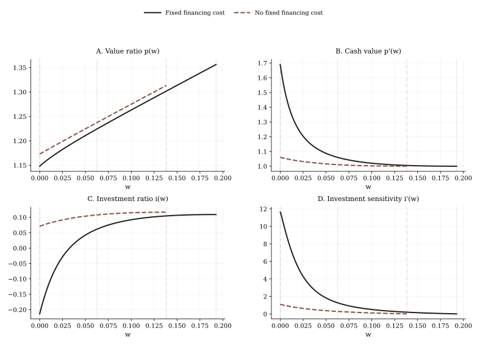

# BCW2011 Refinancing 逐步讲解

建议在 [BCW2011 Liquidation 逐步讲解](./bcw2011-liquidation-walkthrough.md) 之后阅读。

这一页是下面这个仓库脚本的“公式到代码”讲解：

- `src/example/BCW2011Refinancing.py`

## 目标

读完以后，你应该能理解：

- 为什么 Case II 把左边界变成了融资问题；
- 为什么求解器必须同时搜索 `v_left` 和 `s_max`；
- 发行后的目标现金比率 `m` 是如何从数值解里恢复出来的；
- `phi=1%` 与 `phi=0` 的对照为什么对应 Figure 3。

## 运行约定

请在仓库根目录执行：

```bash
MPLBACKEND=Agg uv run python src/example/BCW2011Refinancing.py
```

## 相比 Liquidation，结构上变了什么

内部融资区并没有变。状态变量仍是 `w`，内部 HJB 仍是 BCW Eq. (13)。真正改变的是左边界。

在 liquidation 里，左边界是外生给定的：

$$
p(0) = l.
$$

而在 refinancing 里，左边界变成内生的，因为公司在现金耗尽时会发行股票，而不是清算。

这会引入两类新条件：

- 一个发行时点的 value-matching 方程，
- 一个发行规模最优性的 smooth-pasting 方程。

## 这个案例用到的论文方程

### 内部 HJB 与投资规则

内部区域仍使用 BCW Eq. (13) 和 Eq. (14)：

$$
r p(w) =
\left(i(w) - \delta\right)\left(p(w) - w p'(w)\right)
+ \left((r-\lambda)w + \mu - i(w) - g(i(w))\right)p'(w)
+ \frac{\sigma^2}{2} p''(w),
$$

$$
i(w) = \frac{1}{\theta}\left(\frac{p(w)}{p'(w)} - w - 1\right).
$$

### 发行时的价值匹配：Eq. (19)

$$
p(0) = p(m) - \phi - (1+\gamma)m.
$$

这表示发行前的公司价值，等于发行后价值扣掉固定和比例发行成本。

### 发行规模的一阶条件：Eq. (20)

$$
p'(m) = 1 + \gamma.
$$

这就是发行后目标现金比率 `m` 处的 smooth-pasting 条件。

### 右边界

右侧仍由 BCW Eq. (16) 和 Eq. (17) 决定：

$$
p'(\bar w)=1, \qquad p''(\bar w)=0.
$$

## 为什么会有两个边界 target

这个案例数值上有两个内生未知量：

- payout boundary `\bar w`，
- 左边界 value `p(0)`。

而 `m` 并不是单独被搜索的边界变量。仓库实现里，它是通过求解后网格上满足

$$
p'(m) = 1 + \gamma
$$

的位置反推出的。

因此仓库里的工作流是：

1. 先猜 `v_left = p(0)` 和 `s_max = \bar w`；
2. 在 `[0, \bar w]` 上解内部 HJB；
3. 用导数条件从已解出的网格里恢复 `m`；
4. 计算发行 value-matching 残差；
5. 同时更新左右两个未知量，直到左边发行条件和右边 super-contact 条件都满足。

这就是为什么这里不能再用 liquidation 那种单目标 bisection，而要用 `method="hybr"`。

## 这些方程如何变成 FinHJB 对象

| 经济对象 | FinHJB 对象 | 仓库里的角色 |
|---|---|---|
| 基准参数加发行成本 | `Parameter` | 保存 `phi`、`gamma` 以及经营参数 |
| 边界值 | `Boundary` | 把 `v_left` 暴露成搜索量，把 `v_right` 暴露成 payout 侧边界值 |
| 投资控制 | `PolicyDict` | 保存 `investment` |
| Eq. (14) | `Policy` | 隐式更新 `investment` |
| Eq. (13) | `Model.hjb_residual` | 内部区域 HJB |
| Eq. (19) | `refinancing_boundary_residual(...)` | 左边界发行残差 |
| Eq. (20) | `return_cash_ratio_from_grid(...)` | 从 `grid.dv` 恢复 `m` |

这里最重要的实现思想是：`m` 不是单独的状态变量，也不是一个单独的边界对象，而是一个“由已解网格反推出的经济上有意义的内部点”。

## 为什么这里固定用 `hybr`

这个案例要同时解两个非线性 target：

- `super_contact_residual(grid)` 对应 payout boundary；
- `refinancing_boundary_residual(grid)` 对应 issuance boundary。

这和 liquidation 有本质区别：

- liquidation 只有一个标量 target，且 bracket 很好设；
- refinancing 则是耦合系统，因为 `v_left` 的变化会改变整个 value function，从而同时改变 `m` 和右端曲率形状。

所以仓库把这个案例的正式方法固定为 `hybr`。

## Figure 3：如何读这个对照



### Panel A：`p(w)`

最关键的是左端点：

- 有固定发行成本时，`p(0)` 已经高于 liquidation value；
- 没有固定发行成本时，左端 value 进一步抬高，融资摩擦更轻。

这就是 BCW 里“当 `p(0) > l` 时，再融资优于清算”的数值版本。

### Panel B：`p'(w)`

固定发行成本会显著抬高低现金状态下的边际现金价值，因为内部现金能帮助公司减少支付固定发行成本的频率。

### Panel C：`i(w)`

投资扭曲比 liquidation 小得多，但只要融资成本还在，投资仍然低于 first best。

### Panel D：`i'(w)`

左侧 `i'(w)` 的陡峭程度，是看融资摩擦如何传导到真实投资决策的一个压缩视角。

## 稳定的量级检查

健康运行通常表现为：

- `phi=1%` 时：`\bar w \approx 0.19`、`m \approx 0.06`、`p(0) > l`；
- `phi=0` 时：`\bar w \approx 0.14`、`m \approx 0`；
- 两种情形下 `p'(m) \approx 1.06`。

这些就是和 Figure 3 对照时最应该先看的量。

## 代码检查模式

```python
from src.example.BCW2011Refinancing import run_case

bundle = run_case(number=1000)
for label, result in bundle["results"].items():
    print(label, result["summary"])
```

这个案例最值得先看的字段是：

- `return_cash_ratio`，
- `dv_at_m`，
- `p0_above_l`，
- `payout_boundary`。

## 如何把这个模式迁移到自己的模型

如果你的模型需要下面这些结构，就优先从这个案例起步：

- 发行替代清算，
- 左边界的 value matching，
- 像 `m` 这样的内部 smooth-pasting 点，
- 多个被同时搜索的边界未知量。

很多融资模型其实不需要 Hedging 或 Credit Line 那么复杂，但很需要这一页的结构。

## 下一步

- 继续看 [BCW2011 Hedging 逐步讲解](./bcw2011-hedging-walkthrough.md)。
- 如果你想专门看 `m` 是如何从 `grid.dv` 里识别出来的，再配合 [结果与诊断](./results-and-diagnostics.md) 一起看。
